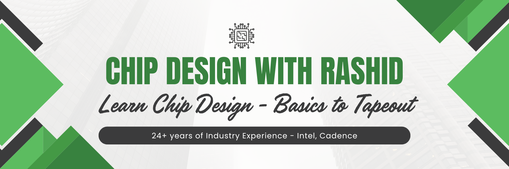

## About Your Instructor { id="about" }

  
  

    
    
    <a href="https://www.youtube.com/@ChipDesignRashid" class="md-button md-button--primary instructor-button" target="_blank" rel="noopener noreferrer">
      Visit the YouTube Channel
    </a>
    <a href="https://www.youtube.com/@ChipDesignRashid/join" class="md-button instructor-button" target="_blank" rel="noopener noreferrer">
      Become a Member
    </a>
    <a href="https://www.linkedin.com/in/rashidco/" class="md-button instructor-button" target="_blank" rel="noopener noreferrer">
      LinkedIn Profile
    </a>
  

  
  

    <h3>Hello! I'm Rashid Iqbal.</h3>
    
I am an IC Design Engineer with a specialization in <strong>Physical Design and Static Timing Analysis (STA)</strong>. I have 24+ years of experience in the semiconductor industry, including leadership roles at companies like Intel and Cadence.

    
    
With a <strong>Master's degree</strong> in Electrical Engineering, my career has spanned <strong>Asia (Pakistan), Europe (Sweden, Germany, Ireland), and the USA (Colorado)</strong>. This global experience brings a unique, practical perspective to complex chip design challenges.

    
    
I started this Youtube channel to provide high-quality, practical training on the complex topics of Digital IC 
Design (Architecture to GDS). My mission is to make this knowledge accessible to everyone. This site organizes my 450+ videos into a clear curriculum to help you find exactly what you need.

  

---

!!! success "Benefits of Channel Membership"
    
    For a small fee (only $2.99/month in the US, ₹89/month in India), you get access to a huge library of exclusive content. My goal is to make this advanced knowledge affordable for everyone.
    
    * **Continuous Learning:** Get 6-8 new, advanced, members-only videos every month.
    * **Exclusive Library:** Most of my new content is for members, giving you a serious edge.
    * **Priority Support:** Members get loyalty badges, so I see and reply to your comments first.
    * **Exclusive Q&A:** Access members-only Q&A posts and career advice.
    * **Industry-Focused:** My teaching style is based on real-world industry experience, not just textbooks.
    * **Future Live Streams:** I will be holding live Q&A sessions for members to answer your questions.
    * **Cancel Anytime:** If you're not happy, you can cancel your membership at any time.

    Ready to start? **[Become a member](https://www.youtube.com/@ChipDesignRashid/join){: target="_blank" rel="noopener noreferrer" }** to support the channel and accelerate your learning.

---

## The Digital IC Design Roadmap: From Architecture to GDSII

My curriculum is focused on **Digital IC Design**, the backbone of ~95% of modern large SoCs and Chiplets. I believe in teaching the full lifecycle, not just isolated steps. 

The design journey starts with high-level **Architecture**, followed by **Microarchitecture** definition and implementation in high-level languages. From there, we transition into Hardware Description Languages (**SystemVerilog**) and the intensive **Physical Design** cycle—encompassing Synthesis, Place & Route, and critical sign-off stages like **Static Timing Analysis (STA)**, layout verification, and formal verification. Only then is the final GDS file ready for the fabrication plant.

My goal is to demystify every stage of this cycle. By providing simple, practical, and clear explanations based on over 25 years of industry experience, I help you land your ideal job and navigate your career with technical confidence.

---
### Unlock Your Career Potential

Whether you are preparing for your first interview or aiming for a Technical leadership role at a top-tier firm, this roadmap gives you the technical depth to stand out.

This roadmap is designed to support the professional growth of three specific groups within the semiconductor ecosystem:

*   **University Students (Bachelor's & Master's):** Transition from textbook theory to industry-ready skills. These tracks provide the practical "missing link" required to excel in technical interviews and secure your first role in a high-stakes design environment.
*   **Early-Career Engineers:** Stop relying on "guesswork" and start solving on-the-job challenges with confidence. By solidifying your core technical knowledge, you can move from performing tasks to mastering the "why" behind complex design decisions.
*   **Experienced Professionals:** Reclaim your technical depth or pivot into emerging fields. Whether you need to refresh your understanding of **Static Timing Analysis (STA)** or master cutting-edge methodologies like **3DIC packaging** and **RISC-V microarchitecture**, these resources provide the advanced insight your career demands.

---

## Track 1: Front-End Design (Architecture, Micro-Arch & RTL)

This track focuses on the logical and structural foundation of the silicon lifecycle. We explore the high-level **Architecture** definition, move into detailed **Microarchitecture** specifications, and translate these concepts into Hardware Description Languages (HDL) like **SystemVerilog**.

Mastering the Front-End is about more than just writing code; it is about designing for efficiency, scalability, and functional correctness. Whether you are building a custom **RISC-V** core or complex SoC logic, these sessions provide the rigorous technical training needed to excel in RTL design and verification. These insights are backed by over 25 years of industry experience across global design centers.

**Here are the playlists, titles, and links (click on each):**

* [Digital Design Basics - Combinational Logic Made Easy (27 Videos)](https://www.youtube.com/playlist?list=PL0-xus8sJBCS-pGojeK0TBn1zVGJ6jJur){: target="_blank" rel="noopener noreferrer" }

* [Digital Design Basics - Sequential Logic Explained (8 Videos)](https://www.youtube.com/playlist?list=PL0-xus8sJBCSJZTEcGy6j6F5EFWLPjsgo){: target="_blank" rel="noopener noreferrer" }

* [RISC-V Architecture Explained - CPU and Peripherals (~40 videos)](https://www.youtube.com/playlist?list=PL0-xus8sJBCRzZtmL_fLWaohRKuc4j5aH){: target="_blank" rel="noopener noreferrer" }

* [Master RISC-V Microarchitecture (~23 videos)](https://www.youtube.com/playlist?list=PL0-xus8sJBCTkqRRH44gbHOqBN57cPNzG){: target="_blank" rel="noopener noreferrer" }

* [Build a RISC-V CPU in Python: From Microarchitecture to Verification (~15 videos)](https://www.youtube.com/playlist?list=PL0-xus8sJBCR3d_KcveIFzQBZnHzeOMHi){: target="_blank" rel="noopener noreferrer" }

* [RISCV CPU Design in System Verilog (In progress)](https://www.youtube.com/playlist?list=PL0-xus8sJBCSOD1WDsne0j958cmttsQil){: target="_blank" rel="noopener noreferrer" }

---

## Track 2: Physical Design & Signoff (Implementation, STA, & Verification)

This track bridges the gap between logical design and physical silicon, focusing on the rigorous "Back-End" cycle required for modern tape-outs. We begin with a deep dive into **CMOS foundations** to understand transistor-level logic, then progress through the entire implementation methodology: **Synthesis, Placement, Clock Tree Synthesis (CTS), and Routing**.

A significant portion of this track is dedicated to **Static Timing Analysis (STA)** and signoff verification. You will learn how to navigate complex timing constraints, perform layout verification, and ensure a design is fully optimized before it is sent to the fabrication plant. These lessons leverage over 25 years of industry experience to help you move beyond guesswork and master the technical precision required by world-class semiconductor firms like Intel and Cadence.

**Here are the playlists, titles, and links (click on each):**

* [CMOS Circuits Made Easy: From Transistor to Logic Gates (28 Videos)](https://www.youtube.com/playlist?list=PL0-xus8sJBCSm5N5AnivBiIVbGyrDEIIK){: target="_blank" rel="noopener noreferrer" }

* [Learn Physical Design and Timing Overview - Complete Methodology (~40 Videos)](https://www.youtube.com/playlist?list=PL0-xus8sJBCTmG_gv4SHc5_3ofdjEZDDo){: target="_blank" rel="noopener noreferrer" }

* [Physical Design Flow Explained - Synthesis to Place & Route](https://www.youtube.com/playlist?list=PL0-xus8sJBCQRHOWa535_X2GyrDlZr9We){: target="_blank" rel="noopener noreferrer" }

* [Full Chip Timing/STA closure - Timing Challenges on Large Dies](https://www.youtube.com/playlist?list=PL0-xus8sJBCQVQw3pQVAJ6y_gzLQ6TAoO){: target="_blank" rel="noopener noreferrer" }

* [Static Timing Analysis (Block Level Flow & Methodology)](https://www.youtube.com/playlist?list=PL0-xus8sJBCTw1aDsx3RXQv3D8MfYJ602){: target="_blank" rel="noopener noreferrer" }

* [Static Timing Analysis Q&As - Common Pitfalls and Insights](https://www.youtube.com/playlist?list=PL0-xus8sJBCTIUAdD1-e7LPTVbeYz9QS5){: target="_blank" rel="noopener noreferrer" }

* [Latch Timing Demystified! Real Scenarios Where Latches Shine](https://www.youtube.com/playlist?list=PL0-xus8sJBCTQ-sJ98q38oNkYwV2rhU48){: target="_blank" rel="noopener noreferrer" }

* [Master Timing Constraints: Basics to Advanced](https://www.youtube.com/playlist?list=PL0-xus8sJBCR2Kwzj7OnRL_rABCXQcF9a){: target="_blank" rel="noopener noreferrer" }

* [Global vs Local Clock Trees — A Practical CTS Guide](https://www.youtube.com/playlist?list=PL0-xus8sJBCQlSBiYaanx1QG4iYY7J6wB){: target="_blank" rel="noopener noreferrer" }

* [The Incredible Shrinking Transistor: 350nm to Cutting Edge](https://www.youtube.com/playlist?list=PL0-xus8sJBCQ9kmdzow_PX_FJ0Ca1HTAM){: target="_blank" rel="noopener noreferrer" }

* [Statistical Timing Analysis (SSTA)](https://www.youtube.com/playlist?list=PL0-xus8sJBCQC5irrh6KfiagR2HNbvU-O){: target="_blank" rel="noopener noreferrer" }

---

### Track 3: Scripting & Automation in Chip Design

A modern designer is also a programmer. This track covers the essential "glue" skills—Tcl for EDA tools, Python for building simulators, and Vim for efficient editing—that will make you a more effective engineer.

* [TCL Scripting for EDA Tools - Learn the Language of Automation](https://www.youtube.com/playlist?list=PL0-xus8sJBCRpVtxjGLwB12YyQKQH2wRW){: target="_blank" rel="noopener noreferrer" }
* [Python for Chip Designers — Build a RISC-V Simulator](https://www.youtube.com/playlist?list=PL0-xus8sJBCSjjaf-MTtGEdh4XgXRQPgz){: target="_blank" rel="noopener noreferrer" }
* [Vim for Chip Designers — The Essential File Editor](https://www.youtube.com/playlist?list=PL0-xus8sJBCSqVDB1XwtK0U3qRpH0QA0Z){: target="_blank" rel="noopener noreferrer" }

---

### Track 4: Career & Industry Insights

Beyond the technical skills, this track offers practical advice on building your career, preparing for interviews, and understanding the semiconductor industry.

* [Chip Design Career Q&A — Real Questions, Real Answers](https://www.youtube.com/playlist?list=PL0-xus8sJBCTfm51EjsyWwJvPDhkYU0Ds){: target="_blank" rel="noopener noreferrer" }

---

